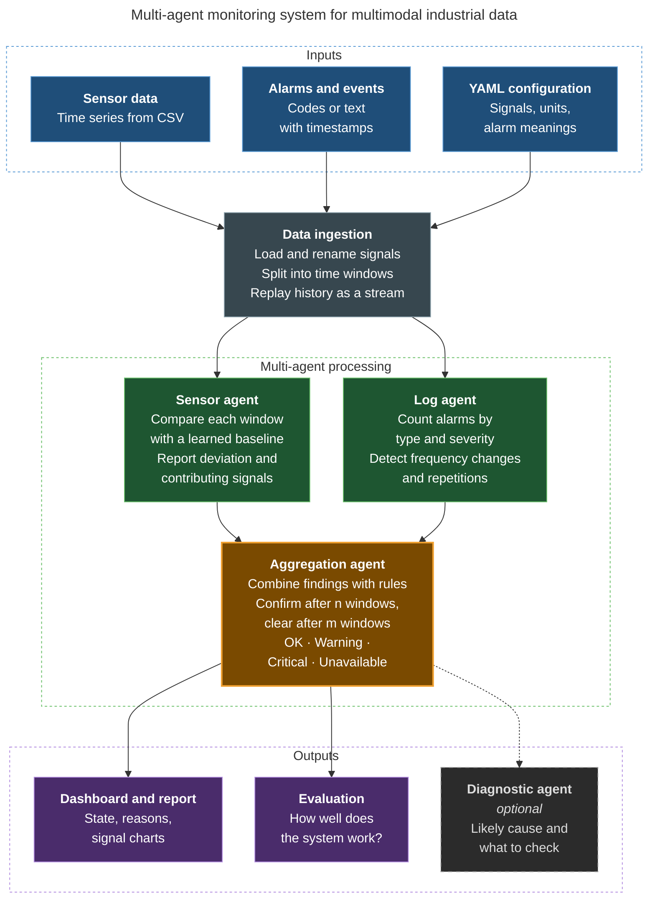

## Architecture

It's the virst version of artitecture and is often generalized as there is no concrete stack yet.
But diagram shows the common flow of the application.

```mermaid
---
title: Multi-agent monitoring system for multimodal industrial data
config:
  flowchart:
    curve: basis
    padding: 16
    nodeSpacing: 40
    rankSpacing: 50
---
flowchart TB
    subgraph INPUTS["Inputs"]
        SENSOR_DATA["<b>Sensor data</b><br>Time series from CSV"]
        EVENTS["<b>Alarms and events</b><br>Codes or text<br>with timestamps"]
        CONFIG["<b>YAML configuration</b><br>Signals, units,<br>alarm meanings"]
    end

    INGEST["<b>Data ingestion</b><br>Load and rename signals<br>Split into time windows<br>Replay history as a stream"]

    subgraph AGENTS["Multi-agent processing"]
        SENSOR_AGENT["<b>Sensor agent</b><br>Compare each window<br>with a learned baseline<br>Report deviation and<br>contributing signals"]
        LOG_AGENT["<b>Log agent</b><br>Count alarms by<br>type and severity<br>Detect frequency changes<br>and repetitions"]
        AGGREGATOR["<b>Aggregation agent</b><br>Combine findings with rules<br>Confirm after n windows,<br>clear after m windows<br>OK · Warning ·<br>Critical · Unavailable"]
    end

    subgraph OUTPUTS["Outputs"]
        DASHBOARD["<b>Dashboard and report</b><br>State, reasons,<br>signal charts"]
        EVALUATION["<b>Evaluation</b><br>How well does<br>the system work?"]
        DIAGNOSTIC["<b>Diagnostic agent</b><br><i>optional</i><br>Likely cause and<br>what to check"]
    end

    SENSOR_DATA --> INGEST
    EVENTS --> INGEST
    CONFIG --> INGEST
    INGEST --> SENSOR_AGENT
    INGEST --> LOG_AGENT
    SENSOR_AGENT --> AGGREGATOR
    LOG_AGENT --> AGGREGATOR
    AGGREGATOR --> DASHBOARD
    AGGREGATOR --> EVALUATION
    AGGREGATOR -.-> DIAGNOSTIC

    classDef input fill:#1f4e79,stroke:#5b9bd5,color:#ffffff
    classDef process fill:#37474f,stroke:#90a4ae,color:#ffffff
    classDef agent fill:#1e5631,stroke:#6abf69,color:#ffffff
    classDef aggregator fill:#7a4a00,stroke:#f0a030,color:#ffffff,stroke-width:2px
    classDef output fill:#4a2c6b,stroke:#b38ee0,color:#ffffff
    classDef optional fill:#2b2b2b,stroke:#9e9e9e,color:#dddddd,stroke-dasharray:5 5

    class SENSOR_DATA,EVENTS,CONFIG input
    class INGEST process
    class SENSOR_AGENT,LOG_AGENT agent
    class AGGREGATOR aggregator
    class DASHBOARD,EVALUATION output
    class DIAGNOSTIC optional

    style INPUTS fill:none,stroke:#5b9bd5,stroke-dasharray:3 3
    style AGENTS fill:none,stroke:#6abf69,stroke-dasharray:3 3
    style OUTPUTS fill:none,stroke:#b38ee0,stroke-dasharray:3 3
```

**Stack**
-
